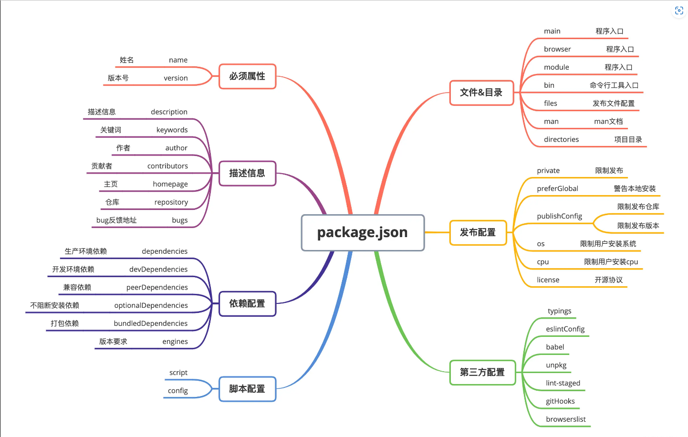

# package.json 详解
创建项目目录后,执行一下命令初始化package.json
```powershell
npm init -y
```
初始化package.json内容
```json
{
  "name": "window-zhongjyuan",
  "version": "1.0.0",
  "description": "",
  "main": "index.js",
  "scripts": {
    "test": "echo \"Error: no test specified\" && exit 1"
  },
  "keywords": [],
  "author": "",
  "license": "ISC"
}
```
## package.json 常见配置项如下:

## 一、必须属性
package.json 中最重要的两个字段就是 name 和 version，它们都是必须的，如果没有，就无法正常执行 npm install 命令。

npm 规定 package.json 文件是由名称和版本号作为唯一标识符的。
## package.json 配置细项如下:
```json
{
    
    "mouth": "index.html",

    /**字符串必须是小写字母或者数字，可以包含.或者_或者-不允许带空格。name必须全局唯一。*/
    "name": "zhongjyuan-window",

    /**项目版本号*/
    "version": "1.0.0",

    /**项目描述*/
    "description": "zhongjyuan window ui",
    
    /**关键字*/
    "keywords": ["zhongjyuan","window","ui"],

    /**项目作者 */
    "author": {
      "name": "zhongjyuan",
      "email": "zhongjyuan@outlook.com",
		  "url": "https://gitlab.zhongjyuan.club/zhongjyuan"
    },

    /**项目贡献者 */
    "contributors": [
      {
        "name": "zhongjyuan",
        "email": "zhongjyuan@outlook.com",
		    "url": "https://gitlab.zhongjyuan.club/zhongjyuan"
      }
    ],

    /**项目主页的链接,通常是项目 github 链接,项目官网或者文档首页 */
    "homepage": "http://zhongjyuan.club",

    /**代码所在的位置 */
    "repository": {
        "type": "gitlab",
        "url": "http://gitlab.zhongjyuan.club/zhongjyuan/window"
    },

    /**项目提交问题的地址 */
    "bugs": {
      "url": "http://gitlab.zhongjyuan.club/zhongjyuan/window/issues",
      "email": "zhongjyuan@outlook.com"
    },

    /**bool值，如果设置为false，将禁用webkit的node支持。*/
    "nodejs": true,

    /**
    * 指定一个node.js文件，当程序启动时，该文件会被运行，启动时间要早于node-webkit加载html的时间。
    * 它在node上下文中运行，可以用它来实现类似后台线程的功能。
    * （不需要可注释不用）
    */
    "node-main": "js/node.js",

    /**
    * bool值。默认情况下，如果将node-webkit程序打包发布，那么只能启动一个该应用的实例。
    * 如果你希望允许同时启动多个实例，将该值设置为false。
    */
    "single-instance": true,
    
    /**窗口属性设置 */
    "window": {
        /**字符串，设置默认title。*/
        "title": "zhongjyuan",

        /**窗口的icon。*/
        "icon": "link.png",
        
        /**bool值。是否显示导航栏。*/
        "toolbar": false,

        /**bool值。是否允许调整窗口大小。*/
        "resizable": true,

        /**是否全屏*/
        "fullscreen": true,

        /**是否在win任务栏显示图标*/
        "show_in_taskbar": true,

        /**bool值。如果设置为false，程序将无边框显示。*/
        "frame": true,

        /**字符串。窗口打开时的位置，可以设置为“null”、“center”或者“mouse”。*/
        "position": "center",

        /**主窗口的的宽度。*/
        "width": 1366,

        /**主窗口的的高度。*/
        "height": 768,

         /**窗口的最小宽度。*/
        "min_width": 400,

        /**窗口的最小高度。*/
        "min_height": 335,
        
        /**窗口显示的最大宽度。(可不设) */
        "max_width": 800,
        
        /**窗口显示的最大高度。(可不设) */
        "max_height": 670,
        
        /**bool值，如果设置为false，启动时窗口不可见。*/
        "show": true,

        /**
         * bool值。是否使用kiosk模式。如果使用kiosk模式，
         * 应用程序将全屏显示，并且阻止用户离开应用。
         * */
        "kiosk": false
    },

    /**webkit设置*/
    "webkit": {
        /**bool值，是否加载插件，如flash，默认值为false。*/
        "plugin": true,

        /**bool值，是否加载Java applets，默认为false。*/
        "java": false,
        
        /**bool值，是否启用页面缓存，默认为false。*/
        "page-cache": false
    },

    /**支持许多内置脚本和它们的预设生命周期事件以及任意脚本,这些你都可以使用 npm run <stage> 来执行 */
    "scripts": {
      "start": "http-server ./ -p 7077 -s"
    },

    /**版本要求 */
    "engines": {
      "node": ">= 6.0.0",
      "npm": ">= 3.0.0"
    },

    /**运行依赖,也就是项目中生产环境下需要用到的依赖 */
    "dependencies": {
        "http-server": "^13.0.1"
    },

    /**开发阶段时需要的依赖包 */
    "devDependencies": {
        "http-server": "^13.0.1"
    }
  }  
```